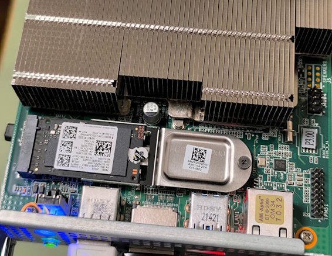
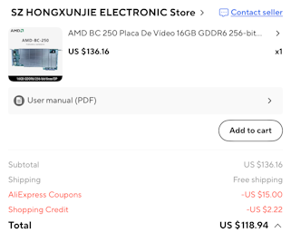
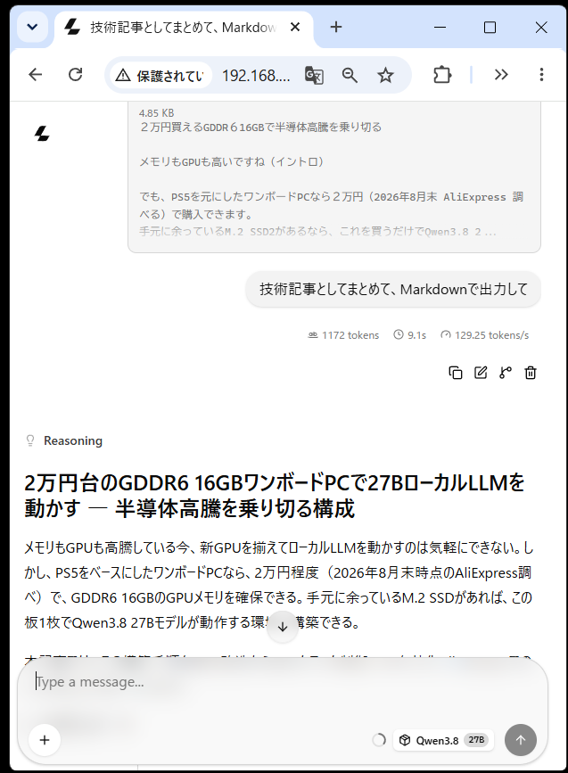

# 2万円のGDDR6 16GBワンボードPCで27BローカルLLMを動かす ― 半導体高騰を乗り切る構成



メモリもGPUも高騰している今、新GPUを揃えてローカルLLMを動かすのは気軽にできない。しかし、PS5をベースにしたワンボードPCなら、2万円程度（2026年8月末時点のAliExpress調べ）で、GDDR6 16GBのGPUメモリを確保できる。手元に余っているM.2 SSDがあれば、この板1枚でQwen3.8 27B 4bit量子化モデルが20tokens/secで動作する環境が構築できる。



筆者購入時の価格です、為替手数料を合わせてぎりぎり2万円でおつりが来ました、2026年9月時点では若干値上がりしているようです、辛いですね。


本記事では、その構築手順をBIOS改造からGPUクロック制御、CU有効化、llama.cppでの動作確認まで順に解説する。


## 注意
最初に重要なことを書いておきます。

この記事では、

- 改造BIOSの書き込み
- GPUクロック・電圧変更
- GPUの無効化されているCUの有効化

を行います。

どれもメーカー保証外の操作です。（そもそもメーカー保証なんてないと思いますが）

最悪の場合、ハードウェア故障や**発煙・発火等の重大事故**につながる可能性があります。

以下はすべて自己責任で。

## 1. 必要なパーツ

| パーツ | 内容 |
|---|---|
| ワンボードPC | BC-250ボード、US$120前後 |
| ストレージ | M.2 SSD（手元の予備で可） |
| 電源 | 12V・約30A程度が供給可能なもの |
| CPU冷却 | かなり強力な冷却ファン 私はARCTIC P12 Pro PSTを使いました |
| メモリ冷却 | 100均のUSBファンで大丈夫だと思う |

電源について補足すると、普通のATX電源も使えるが、**5V・3.3Vが無負荷でも安定するもの**を選んだほうがよい。現在の主流である12V重視モデルなら大体問題ないはずだが、厳密を期すなら電源構成を確認してほしい。

## 2. OSの導入（CachyOS・無GUI最小構成）

OSには **CachyOS** を採用した。特に理由はなく、第一候補だったFedora 44がインストールできなかったため、チャッピーに相談した結果CachyOSを提案された、というのが経緯である。

インストール時のポイントは2つ。

1. **メモリを最大限確保するため、GUIを入れない最小構成**で導入する
2. **BootloaderはGRUB**にする（後続の手順で重要）

## 3. SSHの有効化

インストール完了後、まず再起動し、初回起動でsshdを有効にして外部からログイン可能にする。

```bash
sudo pacman -S openssh
sudo ufw allow 22/tcp
sudo ufw reload
```

以降、GPUメモリを最大化するためのBIOS改造とカーネル引数の設定を進める。

## 4. 改造BIOSの導入とBIOS設定

GPU側へのメモリ割り当てを最大化するため、改造BIOSを導入する。詳細は **`BC250_3.00_CHIPSETMENU.ROM`** で検索すると見つかる。最近のLinuxなら改造BIOSなしで設定できるらしいが、筆者の環境では無理だった。

改造BIOSを焼いた後、BIOS設定で以下を変更する。

- Integrated Graphics Controller = **Forces**
- UMA Mode = **UMA_SPECIFIED**
- UMA Frame Buffer Size = **512MB**
- IOMMU = **Disable**

## 5. TTMのメモリ上限を16GBまで拡大する

UMAを512MBに設定したら、`/etc/default/grub` を編集し、`GRUB_CMDLINE_LINUX_DEFAULT` の**末尾に** `ttm.pages_limit=4194304` を追加する（4194304ページ × 4KB = 16GB、つまりGDDR6の容量全体をTTM管理の上限に合わせる値）。

筆者の環境では、

```
GRUB_CMDLINE_LINUX_DEFAULT='nowatchdog nvme_load=YES splash loglevel=3'
```

を

```
GRUB_CMDLINE_LINUX_DEFAULT='nowatchdog nvme_load=YES splash loglevel=3 ttm.pages_limit=4194304'
```

に変更した。編集が済んだらbootloaderに反映させる。

```bash
sudo grub-mkconfig -o /boot/grub/grub.cfg
```


## 6. GPUガバナの導入（cyan-skillfish-governor-smu）

GPUのクロックを可変化するためのガバナを導入する。初期状態ではGPUは**1500MHzに固定**されているが、これを上下に広げる。

- 上限は2000MHzまでなら問題ないと思われるが、**温度監視しながら様子を見ること**
- 下限はアイドル時の電力低減のため500MHzまで下げる（ただし実際にはGDDR6 IOマクロの電力が大きいため、電力は期待ほど下がらない）

最新のCachyOSならカーネルパッチは不要だった。

### インストールと有効化

```bash
sudo pacman -S cyan-skillfish-governor-smu
sudo systemctl enable --now cyan-skillfish-governor-smu.service
```

### 設定ファイルの編集

`/etc/cyan-skillfish-governor-smu/config.toml` を開き、周波数範囲を拡大する。変更箇所は以下の通り。

```toml
# ここの数字を変更
[frequency-range]
min = 500    # MHz
max = 2000   # MHz

# ここのコメントアウトを外す
[[safe-points]]
frequency = 2000
voltage = 960
```

編集が済んだらガバナを再起動する。

```bash
sudo systemctl start cyan-skillfish-governor-smu
```

## 7. bc250-cu-live-managerによる40CU化

CU（Compute Unit）をライブで有効化する `bc250-cu-live-manager` を使う。

### インストール

```bash
git clone https://github.com/WinnieLV/bc250-cu-live-manager.git
cd bc250-cu-live-manager
chmod +x bc250-cu-live-manager.sh
```

### 実行

GPUガバナを停止した状態で `bc250-cu-live-manager` を起動する。

```bash
sudo systemctl stop cyan-skillfish-governor-smu
sudo ./bc250-cu-live-manager.sh
```

起動時に表示される**CUのマスク状態**を見て判断する。飛び石状（間隔を空けて）に有効化されている場合、飛ばされたCUは不良CUと見てよいので、そこは飛ばして40CU化を進める。

起動時の状態が、こんな風に、D+が左に寄っている状態なら問題ないと思います、D+が飛び石状になっている場合は、そこは不良CUとしてマスクされた領域とみなして飛ばして有効化してください。
```text
  +---------+------+------+------+------+------+------+------------+--------+
  | Row     | WGP0 | WGP1 | WGP2 | WGP3 | WGP4 | SPI  | CC         | CUs    |
  |         | 0-1  | 2-3  | 4-5  | 6-7  | 8-9  |      |            |        |
  +---------+------+------+------+------+------+------+------------+--------+
  | SE0.SH0 |  D+  |  D+  |  D+  |  --  |  --  | 0x07 | 0xffe00000 |   6/10 |
  | SE0.SH1 |  D+  |  D+  |  D+  |  --  |  --  | 0x07 | 0xffe00000 |   6/10 |
  | SE1.SH0 |  D+  |  D+  |  D+  |  --  |  --  | 0x07 | 0xffe00000 |   6/10 |
  | SE1.SH1 |  D+  |  D+  |  D+  |  --  |  --  | 0x07 | 0xffe00000 |   6/10 |
  +---------+------+------+------+------+------+------+------------+--------+
```

40CU化に成功すると、以下の表示になるはずです。
```text
  +---------+------+------+------+------+------+------+------------+--------+
  | Row     | WGP0 | WGP1 | WGP2 | WGP3 | WGP4 | SPI  | CC         | CUs    |
  |         | 0-1  | 2-3  | 4-5  | 6-7  | 8-9  |      |            |        |
  +---------+------+------+------+------+------+------+------------+--------+
  | SE0.SH0 |  D+  |  D+  |  D+  |  S+  |  S+  | 0x1f | 0xffe00000 |  10/10 |
  | SE0.SH1 |  D+  |  D+  |  D+  |  S+  |  S+  | 0x1f | 0xffe00000 |  10/10 |
  | SE1.SH0 |  D+  |  D+  |  D+  |  S+  |  S+  | 0x1f | 0xffe00000 |  10/10 |
  | SE1.SH1 |  D+  |  D+  |  D+  |  S+  |  S+  | 0x1f | 0xffe00000 |  10/10 |
  +---------+------+------+------+------+------+------+------------+--------+
```

40CU化が終わったら、GPUガバナを再起動してクロック制御を戻す。

```bash
sudo systemctl start cyan-skillfish-governor-smu
```

## 8. llama.cppでの動作確認

ここまで来たら、`llama.cpp` を入れる。入れ方はチャッピーに聞いてほしい。
shellから以下を実行して
```bash
uname -vr
```
こんな感じで聞けば大丈夫だと思う

```text
AMD BC-250ボードにインストールLinuxで、Vulkan を使ってllama.cpp を動かしたい、入れ方をおしえて
OSはこれ（ここには上のunameの結果をコピペする)
$ uname -vr
7.2.2-1-cachyos #1 SMP PREEMPT_DYNAMIC Fri, 28 Aug 2026 11:45:06 +0000
```

インストールが終わったら

```text
インストールしたllama.cpp で Qwen3.8-27B-UD-IQ4_XS　を動かしたい
```

で教えてもらえると思う。

Qwen3.8 27Bは**Q4量子化まで**動いた。筆者が使っている起動オプションは以下です。

```bash
./build/bin/llama-cli \
  -m ./models/Qwen3.8-27B-UD-IQ4_XS.gguf \
  --device Vulkan0 \
  --no-mmproj \
  -ngl all \
  -c 16384 \
  -fa on \
  -ctk q5_1 \
  -ctv q5_1 \
  -b 1024 \
  -ub 256 \
  --jinja
```

### Web UIを使う場合

うっかり複数セッションを開くと、一瞬でメモリ不足で落ちる。落ちないように**複数セッションを禁止**するオプションを付ける。
```bash
./build/bin/llama-server \
  -m ./models/Qwen3.8-27B-UD-IQ4_XS.gguf \
  --device Vulkan0 \
  --no-mmproj \
  -ngl all \
  -c 16384 \
  -fa on \
  -ctk q5_1 \
  -ctv q5_1 \
  -b 1024 \
  -ub 256 \
  --jinja \
  --parallel 1 \
  --cache-ram 0 \
  --no-cache-idle-slots \
  --host 0.0.0.0 \
  --port 9931
```

## 9. 成果

ここまでで、**自宅で約20 tokens/secのローカルLLM**が手に入る。2万円板 + 手元のSSD + 12V電源 + ファン、という構成で半導体高騰期を乗り切れる、というわけだ。

この記事は、上で構築したQwen3.8-27B-UD-IQ4_XSにインストール時のメモを渡してまとめてもらいました、これくらいの内容ならできる感じです。（文体が違う箇所は手で追記しました、例えばここ）



それではよいご推論を。

---

