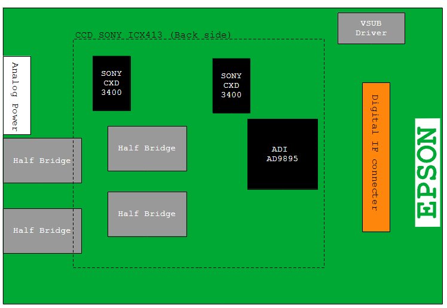
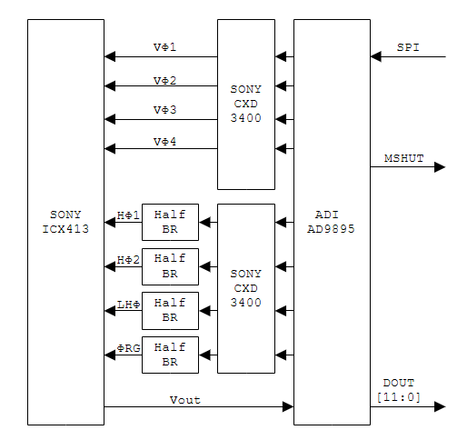

# EPSON Rangefinder Digital Camera R-D1の解析 ― CCD基板編

[← 目次へ戻る](./index.md)

EPSON R-D1は、2004年にEPSONから発売された世界初のMマウント対応レンジファインダーデジタルカメラです。

本記事では、R-D1に搭載されているCCD基板について、基板上の主要デバイスとCCD駆動回路を中心に解析します。

> **注意**
>
> 本記事の内容は、すべて筆者が独自に解析したものです。  
> EPSONおよび各半導体メーカーの公式情報ではありません。
>
> 本記事の内容をもとに、EPSON社や関連メーカーへ問い合わせることはお控えください。
>
> この記事が、R-D1の活用や修理、回路解析の参考になれば幸いです。

CCD基板そのものの写真については、[Camera QuestのEpson R-D1: Total stripdown](http://cameraquest.com/Epson-R-D1/_r-d1/r-d1_18a.htm)に掲載されている分解写真が参考になります。

---

## CCD基板の構成

**図1：CCD基板を部品面側から見たレイアウト。CCDは基板裏面に実装されています**

図1は、R-D1のCCD基板を部品面側から見たレイアウトを模式的に示したものです。

イメージセンサーにはSONY製 ICX413 CCDが使用されており、CCD本体はこの基板の裏面に実装されています。

基板上の主要なデバイスは次のとおりです。

- SONY ICX413 CCD
- Analog Devices AD9895
- SONY CXD3400N × 2
- CCD水平転送系用ハーフブリッジ回路
- デジタルIFコネクタ
- VSUBドライバ
- アナログ電源入力部

この基板は、単純なCCD搭載基板というより、CCDを駆動し、そのアナログ出力をデジタルデータへ変換するところまでを一体化したCCDフロントエンド基板と考えることができます。
この基板は低ノイズであることが重要なので、熱雑音と外来ノイズの最小化を狙ったアルミ製のお弁当箱構造になっています。

---

## CCDへの電源供給

図1左上にあるハンダ付け接続部は、CCD基板への電源入力です。

CCDを駆動するため、ここには正負の電源が供給されます。

コネクタではなくハンダ付けで接続されている理由については推測になりますが、CCD周辺のアナログ回路では電源インピーダンスや電圧変動が画質に影響するため、接点抵抗を避け、安定した電源供給を行うためであると考えられます。

---

## CCDフロントエンドの中心、AD9895

CCDを除いて基板上でもっとも重要なLSIが、Analog Devices製 AD9895 です。

AD9895はデジタルカメラ向けのCCD Signal Processor / Timing Generatorで、R-D1では大きく分けて次の役割を担っています。

1. CCD駆動用タイミング／クロック信号の生成
2. CCDから出力されたアナログ映像信号の処理
3. 12bit ADCによるA/D変換
4. デジタル画像データの出力

つまり、CCDを動かすためのタイミング生成と、CCDから得られたアナログ信号のデジタル化を、AD9895がまとめて担当しています。

---

## CCD駆動クロック

**図2：AD9895、CXD3400N、ハーフブリッジ、ICX413間のCCD駆動信号系統**

**間違っています、後日訂正します(2026/10/06)**

AD9895で生成されたクロック信号は、そのままではCCDを直接駆動できません。

CCDのクロック入力は比較的大きな容量性負荷を持つため、十分な電流で高速に充放電できるドライバが必要になります。

そのためR-D1では、AD9895の出力をSONY製CCDクロックドライバ CXD3400N に入力し、CCDを駆動しています。

基板上にはCXD3400Nが2個搭載されています。

---

### 垂直転送クロック VΦ1～VΦ4

**間違っています、後日訂正します(2026/10/06)**

CCDの垂直転送に使用される

- VΦ1
- VΦ2
- VΦ3
- VΦ4

の4信号は、CXD3400NからICX413へ接続されています。

信号経路は概略として、

`AD9895 → CXD3400N → ICX413`

となります。

---

### 水平転送系クロック

水平転送系では、

- HΦ1
- HΦ2
- LHΦ
- ΦRG

の4信号が使用されています。

~~これらについてはCXD3400Nの出力からCCDへ直接接続するのではなく~~、さらにハーフブリッジ回路を経由してICX413へ接続されています。

信号経路は、

`AD9895 → CXD3400N(経由しません)→ Half Bridge → ICX413`

となります。

#### HΦ1 / HΦ2

HΦ1、HΦ2はCCDの水平転送クロックです。

水平CCDレジスタを高速で駆動するため負荷が重く、~~CXD3400Nの出力を~~さらにハーフブリッジでバッファしてからCCDへ入力しています。

#### LHΦ

LHΦについては、負荷そのものはHΦ1/HΦ2ほど重くないですが、HΦ2との伝搬遅延（Tpd）を揃えるためにHΦ2と同様のハーフブリッジを経由していると予想します

CCDの高速クロックでは、単純な論理レベルだけでなく、信号間の位相関係や伝搬遅延も重要になります。

#### ΦRG

ΦRGはCCD出力段のリセットゲートを駆動する信号です。

この信号も負荷が大きいため、ハーフブリッジを経由してCCDへ入力されています。

---

## CCD基板内でアナログ処理が完結する

R-D1のCCD基板で興味深い点は、デジタルカメラとして必要になるアナログ系の主要処理がこの基板上で完結していることです。
外部からSPI経由でAD9895を設定すると、タイミングジェネレータによってCCDの駆動が開始されます。
露光前の電化の高速掃き出し、露光およびCCDからの読み出し後、CCDのアナログ出力はAD9895で処理・A/D変換され、12bitのデジタルデータとして基板外へ出力されます。
このため、システム側から見るとCCD基板は、
「SPIで制御し、デジタル画像データを受け取るCCD撮像モジュール」
に近い構成になっています。

---

## メイン基板とのインターフェース

CCD基板とカメラ本体側は、図1右側のデジタルIFコネクタを介して接続されています。
AD9895へのSPIコマンドは、（おそらく）NEC 78K系マイコンから制御されています。
一方、AD9895でA/D変換された画像データは、EPSON製ASIC EDIARTへ接続されています。

---

## まとめ

R-D1のCCD基板を解析すると、CCD周辺回路が非常に明快な構成になっていることが分かります。
中心となるAD9895がCCD駆動タイミングを生成し、CXD3400NとハーフブリッジによってICX413を駆動します。
そしてICX413から得られたアナログ画像信号を再びAD9895へ戻し、A/D変換したうえでデジタルデータとしてメイン基板へ送出します。

2000年代初頭のデジタルカメラではありますが、CCD駆動・アナログフロントエンド・A/D変換を一枚の基板にまとめ、デジタル側とは比較的明確に分離するという構成は、回路を追ってみると非常に合理的です。
R-D1を修理・解析する場合、CCD基板を単純な「センサー基板」と見るのではなく、CCD撮像系全体を構成する独立したアナログ／デジタルフロントエンドとして捉えると、信号の流れを理解しやすくなると思います。

---

[← 目次へ戻る](./index.md)
