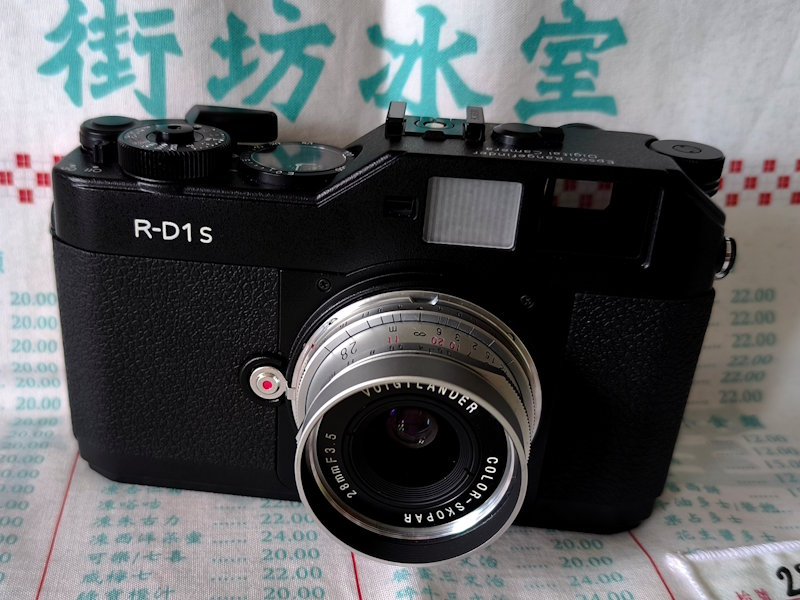
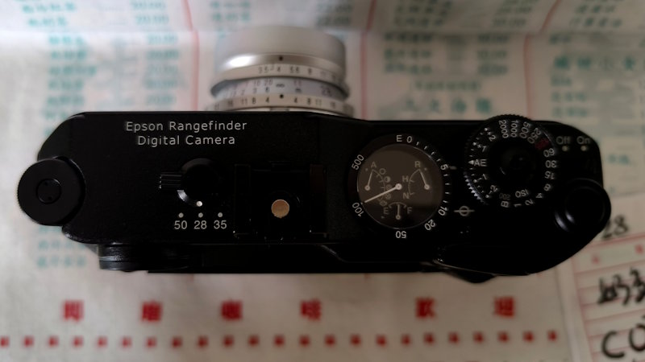
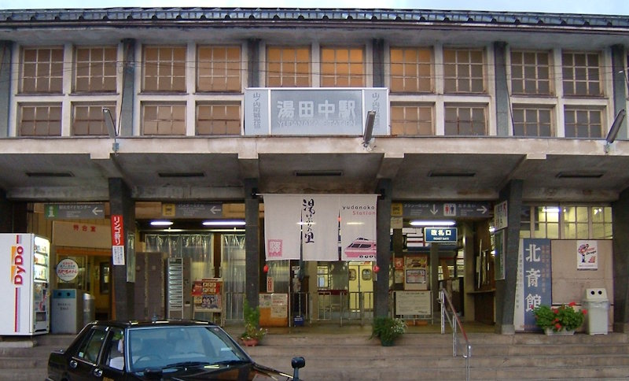

# EPSON Rangefinder Digital Camera R-D1の解析

EPSON R-D1のハードウェア構成と画像処理系について、実機・基板・部品・特許資料などから解析した内容をまとめています。

R-D1は2004年に発売された、世界初のMマウント互換（EPSON EMマウント）レンジファインダーデジタルカメラです。  
当時デジタル一眼レフにも採用されていたSONY製APS-CサイズCCDを搭載し、重厚な金属ボディによる優れた放熱性と高いシールド性によって、熱雑音や外来ノイズの影響を抑えた透明感のある写真を生み出すデジタルカメラです。

ここでは、CCDフロントエンド、電気系全体、EPSON製画像処理ASICを中心に、内部設計を解析しています。

  
  

---

## Documents

### [CCD / CCDフロントエンド](ccdboard.md)

SONY ICX413、Analog Devices AD9895、CCD駆動回路など、CCD基板と撮像フロントエンドの解析です。

### [電気系全体](electorical.md)

R-D1内部の基板構成、NEC 78K0、AD9895、EPSON EDiART ASIC、電源・シャッター系を含む電気系全体の整理です。

### 画像処理ASIC

2002〜2004年ごろのEPSON特許を主な根拠として、R-D1に搭載されたEDiART画像処理ASICの内部を推定しています。  
（現在作成中です）

---

## Yudanaka

「湯田中（Yudanaka）」はR-D1の開発コードネームです。湯田中温泉は、共同開発を行ったコシナの所在地にも近い長野県北部にあり、長い歴史を持つ温泉地として知られています。

[開発リーダーが当時を振り返る。エプソンR-D1「最後の感謝企画」Impress デジカメ Watch 2022年1月25日](https://dc.watch.impress.co.jp/docs/news/eventreport/1382814.html)

---

> [!IMPORTANT]
> 本リポジトリの内容は、筆者が独自に行った解析・調査・推定に基づくものです。  
> EPSON、コシナ、ソニー、Analog Devices、NEC（現ルネサス エレクトロニクス）など各メーカーが公開したR-D1の回路情報ではありません。
>
> 本リポジトリの内容について、各メーカーへの問い合わせは行わないようお願いします。

R-D1を現在も使用している方、故障解析や修理、当時のデジタルカメラ設計を調査している方の参考になれば幸いです。
